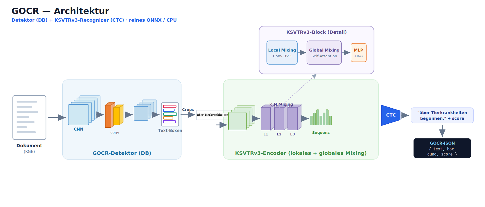
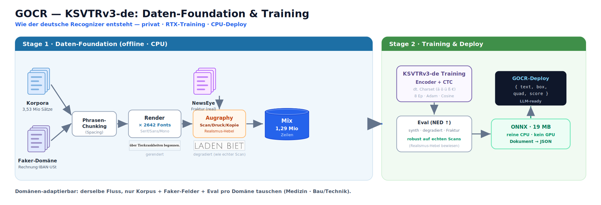

# GOCR — schnelle, kleine deutsche OCR-/Vision-Schicht (CPU)

Liest ein **ganzes Dokument** zu **Text + Position (bbox)** als strukturiertes JSON —
**~30 MB, reine CPU, kein GPU**. Gedacht als **OCR-/Vision-Schicht für (text-only) LLM-Pipelines**
und als **Tooling**: präzise Layout-Boxen + Text rein → dein LLM macht Verständnis/Extraktion.

```bash
pip install g-ocr           # Bilder: png/jpg/webp/tiff/bmp ...
pip install "g-ocr[pdf]"    # + PDF-Support (optionales Plugin)
```
```python
import g_ocr
ocr = g_ocr.from_pretrained()
res = ocr.read("dokument.png")            # ein Bild      -> {text, regions:[{text, box, quad, score}]}
doc = ocr.read_document("rechnung.pdf")   # PDF/mehrseitig -> {n_pages, pages:[...], text}
```

**Node / JavaScript** (`npm install g-ocr`):
```js
const gocr = require("g-ocr");
const ocr = await gocr.fromPretrained();
const res = await ocr.read("dokument.png");   // { text, regions:[{ text, box, quad, score }] }
```

## Stärken
- 🎯 **Präzise Bounding-Boxes**, ganzes Dokument, Lesereihenfolge → strukturiertes JSON
- ⚡ **CPU, bis ~16× schneller als EasyOCR** — kein GPU
- 📦 **~30 MB** (Detektor ~12 + Recognizer ~18) · 🧱 **Fraktur-robust** · on-prem/DSGVO · 🤖 **LLM-ready**
- 🗂️ **Bilder (png/jpg/webp/tiff/bmp …) + PDF** (bis ~500 Seiten) → ein API-Aufruf, JSON pro Seite

## Benchmarks (deutsche Eval-Sets, CPU)
**KSVTRv3-de** — deutscher Recognizer, eigene deutsche Eval-Sets (NED ↑ = Zeichen-Ähnlichkeit, höher = besser):

| Set | NED ↑ | ~CER |
|---|--:|--:|
| Modernes Deutsch (clean) | **0,91** | ~9 % |
| Degradierte Scans (Augraphy) | **0,85** | ~15 % |
| Fraktur (NewsEye, real) | **0,74** | ~26 % |

KSVTRv3-de ist ein **deutscher Spezialist** — robust auf echten/verrauschten Scans und Fraktur
(Augraphy-Realismus im Training), trainiert auf deutschen Korpora (Leipzig) + Domänenfeldern
(Rechnung/IBAN/USt-IdNr) + 2642 Dokument-Fonts. Auf sauberem modernem Deutsch sind dedizierte
Engines (z. B. Tesseract) bei reiner Zeichengenauigkeit teils vorn; GOCRs Stärke ist die **robuste,
on-prem, integrierte** Dokument→JSON-Schicht (CPU, klein, LLM-ready).

## Architektur
**GOCR-Detektor** (DB-basiert) + **KSVTRv3-de-Recognizer** (SVTR-Encoder + CTC, deutscher Charset) — reines ONNX/CPU.



So entsteht der deutsche Recognizer (Daten-Foundation → Training → Deploy):



## CLI
```bash
g-ocr dokument.png              # JSON (text + box + quad)
g-ocr rechnung.pdf              # PDF -> JSON je Seite (Plugin: g-ocr[pdf])
g-ocr dokument.png --text-only  # nur Text (Lesereihenfolge)
```

## Links
- 🤗 Modell + Card: https://huggingface.co/Keyven/g-ocr
- 🖥️ Demo: https://huggingface.co/spaces/Keyven/GOCR-Demo
- 🌐 https://german-ocr.de

## Credits & Upstream
GOCR baut auf hervorragender Open-Source-Arbeit auf (jeweils **Apache-2.0**):
- **OpenOCR** ([Topdu/OpenOCR](https://github.com/Topdu/OpenOCR)) — Detektor (DB) + Recognizer (RepSVTR / SVTR-Familie) + Trainings-Framework.
- **PaddleOCR** ([PaddlePaddle/PaddleOCR](https://github.com/PaddlePaddle/PaddleOCR)) — Zeichen-Dictionary (`ppocr_keys_v1`).

Beide stehen unter Apache-2.0; die Lizenz- und Urheberhinweise gelten fort (siehe [`NOTICE`](NOTICE)).

## Lizenz
Apache-2.0 — siehe [`LICENSE`](LICENSE) und [`NOTICE`](NOTICE).
